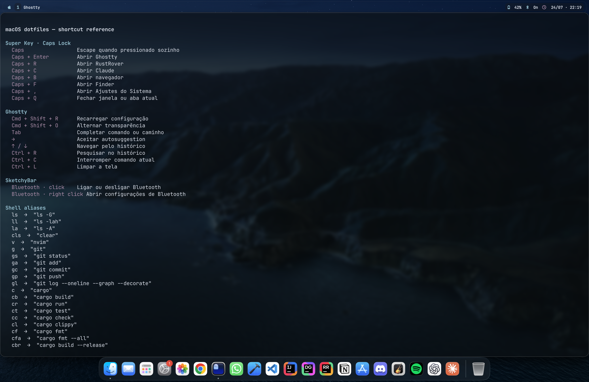

# macOS Dotfiles

A personal macOS environment inspired by Arch Linux and Hyprland, while keeping the native macOS window management and animations.

The setup combines a transparent Ghostty terminal, a compact Starship prompt, a custom SketchyBar, Zsh quality-of-life plugins, and a Caps Lock–based Super Key for launching applications.



## Setup

- **Ghostty** — transparent, maximized terminal with a cohesive ANSI palette
- **Starship** — minimal prompt with directory, Git and systems-language context
- **SketchyBar** — custom status bar with Spaces, current app, Bluetooth, battery and clock
- **Karabiner-Elements** — Caps Lock as Escape when tapped and Hyper/Super when held
- **Zsh** — autosuggestions, syntax highlighting, aliases and a shortcut reference command

The native macOS window manager remains untouched, so Mission Control, Spaces, snapping and system animations continue to behave normally.

## Installation

Clone the repository wherever you prefer. The installer resolves the repository path automatically.

```sh
git clone https://github.com/dwego/macos-dotfiles.git
cd macos-dotfiles
chmod +x install.sh
./install.sh
```

Homebrew is required. The script installs the required formulae, casks and font, creates backups of conflicting configuration files, links the dotfiles, and starts SketchyBar.

After installation, finish the permissions requested by Karabiner-Elements and enable the imported **macOS Super Key** rules under:

```text
Karabiner-Elements → Complex Modifications → Add predefined rule
```

Reload the shell with:

```sh
exec zsh
```

## Super Key

Caps Lock acts as the setup's Super Key.

| Shortcut | Action |
|---|---|
| `Caps` | Escape when tapped alone |
| `Caps + Enter` | Open Ghostty |
| `Caps + R` | Open RustRover |
| `Caps + C` | Open Claude |
| `Caps + B` | Open the default browser |
| `Caps + F` | Open Finder |
| `Caps + ,` | Open System Settings |
| `Caps + Q` | Close the current window or tab |

## Terminal shortcuts

| Shortcut | Action |
|---|---|
| `Cmd + Shift + R` | Reload Ghostty configuration |
| `Cmd + Shift + O` | Toggle terminal opacity |
| `→` | Accept the current autosuggestion |
| `↑ / ↓` | Navigate command history |
| `Ctrl + R` | Search command history |
| `Ctrl + L` | Clear the terminal |

Run the following command at any time to see the complete shortcut and alias reference:

```sh
shortcuts
```

The shorter alias also works:

```sh
keys
```

## Repository structure

```text
.
├── bin/
│   └── shortcuts
├── ghostty/
│   └── config.ghostty
├── karabiner/
│   └── assets/complex_modifications/super-key.json
├── shell/
│   └── zshrc
├── sketchybar/
│   ├── plugins/
│   └── sketchybarrc
├── starship/
│   └── starship.toml
├── install.sh
└── README.md
```

## Useful commands

```sh
# Reload SketchyBar
sketchybar --reload

# Reload the current Zsh environment
exec zsh

# Show all configured shortcuts and aliases
shortcuts
```

## Notes

The installer is designed for macOS 13 or newer and does not replace native window management.

Some macOS permissions cannot be granted by a shell script. Karabiner-Elements may request Input Monitoring or Accessibility access during the first launch.

The RustRover and Claude launchers expect those applications to already be installed. The installer warns when either application is missing.
